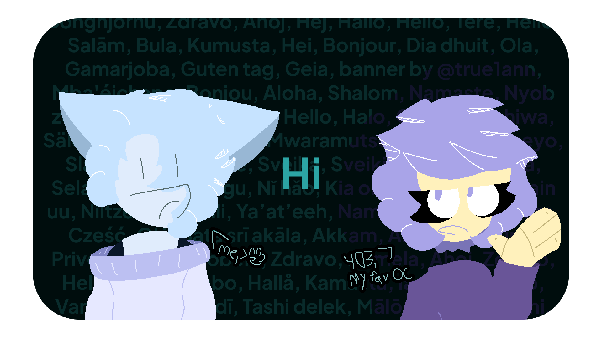

  <h1>Other languages</h1>
  
  [Русский](README.ru.md)

 

  <h1>Hello there!</h1>
  She / Her • MtF train 
  My mainline stuff I use & make goes here, usually. Soon more projects will be here.  
  
  Other info; contacts; statuses; and more are on my [website](https://ann.maxy.top). 
  (Or view the [outdated one](https://ann.is-a.dev/old-index.html))

 

  <h1>Stats</h1>
   
  

 

  <h1>Misc</h1>

  - Hotlinks; assets; themes; and NC plugins at the [OpenData repository](https://github.com/true1ann/opendata). 
  
   <small>More stuff coming soon.</small>

