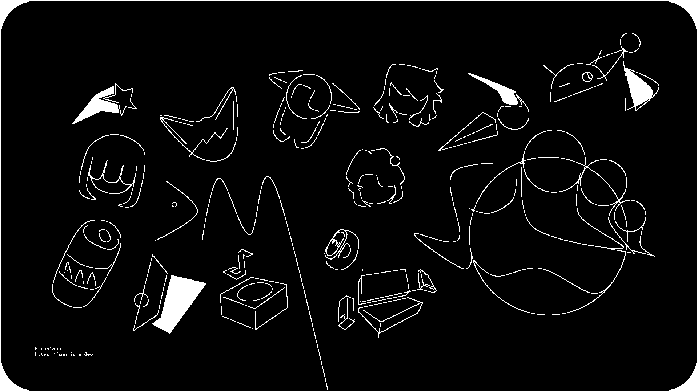

## Другие языки
[English](README.md)

## Здарова!
Она • Транс  
Мои основные проекты и инструменты *обычно* находятся здесь. Я не стою на месте так что будут новые.  

Другая информация, контакты, статусы и другая чушь на [моем сайте](https://ann.is-a.dev).  
<small>(еще есть [устаревшая версия](https://ann.is-a.dev/old-index.html) с GitHub Pages, фронтенд переедет на GitHub Pages скоро)</small>

## Разница между `git`ами
- **GitHub**: Мои публичные проекты, готовые для всех  
- **[git.tann](https://git.true1ann.me)**: Беты моих проектов  

## Статистика
  
  

## Разное
- Хотлинки, ассеты, темы и другие вещи в [OpenData](https://github.com/true1ann/opendata) репо.  

 <small>Скоро будет больше.</small>
